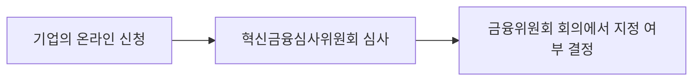

# 시범 요약: 새 금융서비스 신청과 지정은 별개

이 문서는 2026-09-14에 본문을 확인한 금융위원회 공지 한 건으로 만든 **작성 형식 시범**입니다. 정기 마감 이후 조사했으며 게시 시각은 확인되지 않아, 당일 18시 기준 일일 뉴스로 분류하지 않습니다.

## 무슨 일이 있었나

금융위원회는 혁신금융서비스 지정 신청을 2026년 9월 14일 09시부터 9월 30일 18시까지 온라인으로 받는다고 안내했습니다. (C1) [금융위원회 공지, 2026-09-14](https://www.fsc.go.kr/no010101/87705?curPage=&srchBeginDt=&srchCtgry=&srchEndDt=&srchKey=&srchText=)

## 쉽게 설명하면

기업이 신청서를 제출한 뒤 심사를 받고, 금융위원회 회의에서 지정 여부가 최종 결정되는 절차입니다. 접수 자체를 지정 완료로 이해하면 안 됩니다. (C2) [절차 근거](https://www.fsc.go.kr/no010101/87705?curPage=&srchBeginDt=&srchCtgry=&srchEndDt=&srchKey=&srchText=)

## 한눈에 보기

텍스트 설명: 신청 → 심사 → 지정 여부 결정. 위 도식은 공지의 절차를 직접 정리한 것이며 승인 결과를 예측하지 않습니다. (V1) [도식 근거](https://www.fsc.go.kr/no010101/87705?curPage=&srchBeginDt=&srchCtgry=&srchEndDt=&srchKey=&srchText=)

## 수집·검증 범위

금융위원회 공지 본문만으로 작성했습니다. 금융권 전체의 주요 뉴스 선정이나 다른 기관의 독립 검수를 거친 자료는 아닙니다. 접속하지 못한 다른 공지의 세부 내용은 포함하지 않았습니다. [검증 기록](../evidence/2026/09/2026-09-14-pilot.md)

## 정정 기록

최초 작성. 원문 문장·사진·도표의 복제 없이 핵심 사실과 절차를 새로 정리했습니다.
